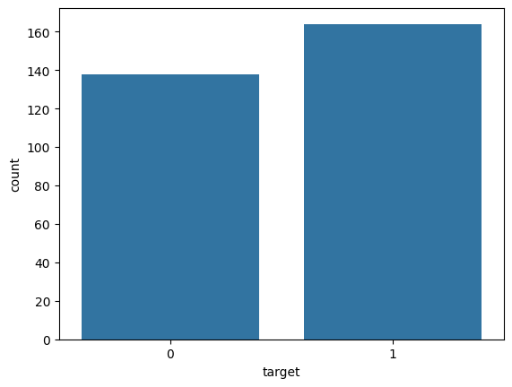
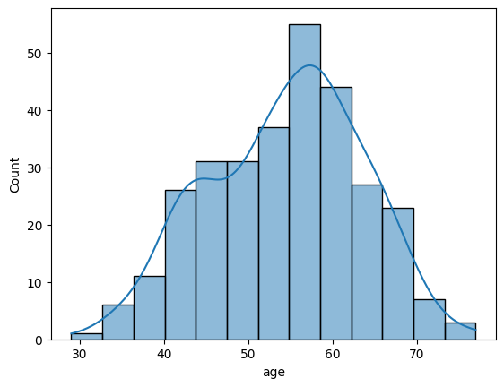
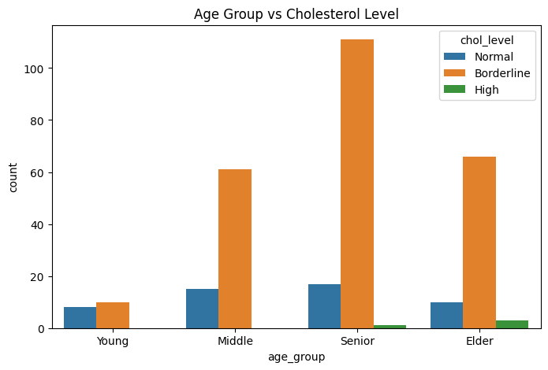
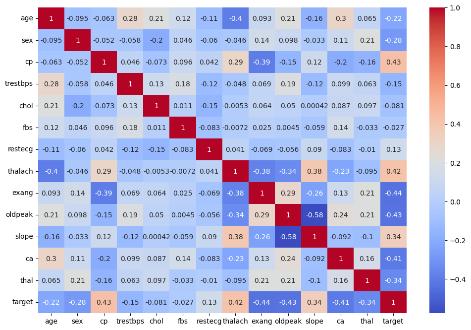
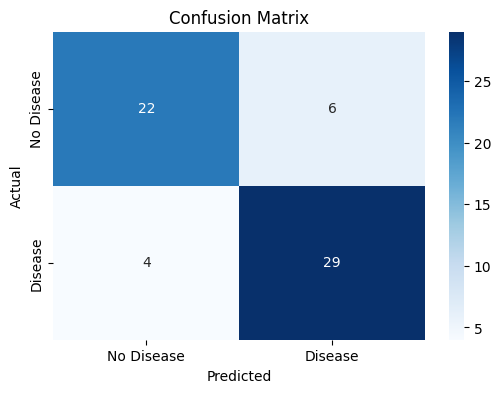
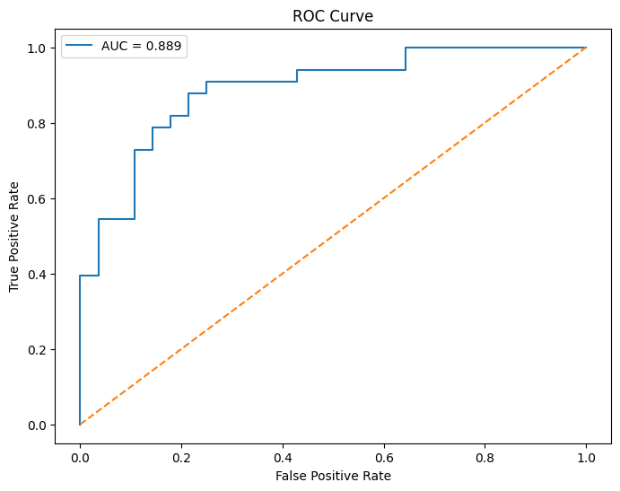
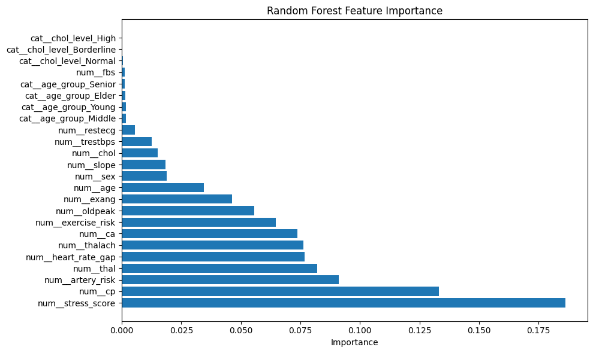

# ❤️ Heart Disease Prediction using Machine Learning

## End-to-End Machine Learning Classification Project

Predicting the presence of heart disease using patient clinical and demographic information through a complete machine learning workflow.

---

# 📌 Project Overview
This project develops a machine learning classification model capable of predicting whether a patient is likely to have heart disease based on various clinical measurements and health indicators.

The project demonstrates the complete machine learning lifecycle, including:

* Data Cleaning
* Duplicate Record Analysis
* Exploratory Data Analysis (EDA)
* Feature Engineering
* Data Preprocessing
* Pipeline Construction
* Model Training
* Model Evaluation
* Cross Validation
* Hyperparameter Tuning
* Feature Importance Analysis
* Model Persistence

The objective is to identify important cardiovascular risk factors and build a reliable predictive model for heart disease detection.

---

# 🎯 Problem Statement

Heart disease remains one of the leading causes of death worldwide. Early identification of individuals at risk can support healthcare professionals in making timely decisions and improving patient outcomes.

Can heart disease be accurately predicted using clinical indicators such as:

* Age
* Sex
* Chest Pain Type
* Blood Pressure
* Cholesterol Level
* ECG Results
* Maximum Heart Rate
* Exercise-Induced Angina
* ST Depression
* Number of Major Vessels
* Thalassemia Test Results

This project investigates the relationship between these variables and heart disease using supervised machine learning classification techniques.

---

# 📂 Dataset Information

### Dataset Shape

* Original Dataset: 1025 Rows
* Unique Records After Cleaning: 302 Rows
* Features: 13
* Target Variable: 1

### Target Variable

| Value | Meaning          |
| ----- | ---------------- |
| 0     | No Heart Disease |
| 1     | Heart Disease    |

### Dataset Features

| Feature  | Description                       |
| -------- | --------------------------------- |
| age      | Age of patient                    |
| sex      | Gender of patient                 |
| cp       | Chest pain type                   |
| trestbps | Resting blood pressure            |
| chol     | Serum cholesterol                 |
| fbs      | Fasting blood sugar               |
| restecg  | Resting ECG results               |
| thalach  | Maximum heart rate achieved       |
| exang    | Exercise induced angina           |
| oldpeak  | ST depression induced by exercise |
| slope    | Slope of peak exercise ST segment |
| ca       | Number of major vessels           |
| thal     | Thalassemia test result           |

---

# 🧹 Data Cleaning

### Duplicate Analysis

The original dataset contained:

* 1025 records

Duplicate analysis revealed:

* 723 duplicate observations

After removing duplicate records:

* Final Dataset Size: 302 unique patient records

### Why Remove Duplicates?

Keeping duplicate observations may:

* Introduce data leakage
* Bias model training
* Artificially inflate model performance

Removing duplicates ensured that the model learned from unique patient records only.

---

# 🔍 Exploratory Data Analysis

EDA was performed to understand:

* Target distribution
* Feature distributions
* Correlations
* Clinical relationships
* Age and cholesterol trends

### Key Findings

* The dataset is relatively balanced.
* Most patients belong to the 45–65 age group.
* Chest pain type is strongly associated with heart disease.
* Maximum heart rate achieved shows significant predictive power.
* Exercise-induced angina is highly related to heart disease occurrence.
* Borderline cholesterol levels are common among middle-aged and senior patients.

---

# ⚙️ Feature Engineering

Several domain-inspired features were created to improve model performance.

## 1. Stress Score

Formula:

stress_score = oldpeak + exang + ca

Purpose:

Represents overall cardiovascular stress by combining ECG abnormalities, exercise-induced chest pain, and vessel blockage information.

---

## 2. Artery Risk

Formula:

artery_risk = ca × thal

Purpose:

Captures the combined impact of vessel blockage and thalassemia-related abnormalities.

---

## 3. Exercise Risk

Formula:

exercise_risk = exang × oldpeak

Purpose:

Measures exercise-related cardiovascular abnormalities.

---

## 4. Heart Rate Gap

Formula:

heart_rate_gap = (220 - age) - thalach

Purpose:

Measures deviation from the expected maximum heart rate.

---

## 5. Age Group

Patients were grouped into:

* Young
* Middle
* Senior
* Elder

Purpose:

Facilitates age-based trend analysis.

---

## 6. Cholesterol Level

Patients were grouped into:

* Normal
* Borderline
* High

Purpose:

Provides a more interpretable representation of cholesterol-related risk.

---

# 🏗️ Machine Learning Pipeline

The entire workflow was built using Scikit-Learn Pipelines.

Raw Data

↓

ColumnTransformer

├── StandardScaler (Numerical Features)

└── OneHotEncoder (Categorical Features)

↓

SelectKBest

↓

Random Forest Classifier

↓

Heart Disease Prediction

### Benefits

* Prevents data leakage
* Simplifies deployment
* Ensures reproducibility
* Automates preprocessing

---

# 🤖 Models Compared

| Model               | Train Accuracy | Test Accuracy |
| ------------------- | -------------- | ------------- |
| Logistic Regression | 85.89%         | 77.05%        |
| Random Forest       | 91.29%         | 81.97%        |
| SVM                 | 92.95%         | 78.69%        |
| KNN                 | 89.63%         | 73.77%        |
| Decision Tree       | 91.70%         | 75.41%        |

### Selected Model

Random Forest Classifier

### Reasons

* Highest test accuracy
* Strong generalization capability
* Stable cross-validation performance
* Handles feature interactions effectively
* Reduced overfitting compared to other models

---

# 📈 Model Performance

| Metric                    | Score  |
| ------------------------- | ------ |
| Accuracy                  | 83.61% |
| Precision                 | 82.86% |
| Recall                    | 87.88% |
| F1 Score                  | 85.29% |
| ROC-AUC                   | 88.90% |
| Cross Validation Accuracy | 80.08% |

### Interpretation

The model successfully identifies heart disease patients with high recall while maintaining balanced precision and overall classification performance.

---

# 🔬 Confusion Matrix Analysis

Results:

* True Positives: 29
* True Negatives: 22
* False Positives: 6
* False Negatives: 4

### Observation

The model successfully detected most heart disease cases while maintaining a relatively low number of incorrect predictions.

---

# 🏆 Feature Importance Insights

Most Influential Features:

1. Stress Score
2. Chest Pain Type
3. Artery Risk
4. Thal
5. Heart Rate Gap
6. Thalach
7. CA

The engineered features emerged among the strongest predictors, demonstrating the effectiveness of feature engineering.

---

# 🖼️ Visualizations

The project includes:

* Target Distribution
* Age Distribution
* Age Group vs Cholesterol Level
* Correlation Heatmap
* Confusion Matrix
* ROC Curve
* Feature Importance Plot

---

# 📷 Project Screenshots

## Target Distribution



---

## Age Distribution



---

## Age Group vs Cholesterol Level



---

## Correlation Heatmap



---

## Confusion Matrix



---

## ROC Curve



---

## Feature Importance




---


# 💾 Model Persistence

The final trained pipeline was saved using Joblib.

```python
import joblib

joblib.dump(best_model, "models/heart_disease_model.pkl")

model = joblib.load("models/heart_disease_model.pkl")

prediction = model.predict(X_new)
```

---

# 🛠️ Technologies Used

* Python
* Pandas
* NumPy
* Matplotlib
* Seaborn
* Scikit-Learn
* Joblib
* Jupyter Notebook

---

# 🧠 Skills Demonstrated

* Data Cleaning
* Duplicate Analysis
* Exploratory Data Analysis
* Feature Engineering
* Feature Encoding
* Feature Scaling
* Pipeline Construction
* Classification Modelling
* Hyperparameter Tuning
* Cross Validation
* ROC Analysis
* Feature Importance Analysis
* Model Evaluation
* Model Serialization

---

# 📂 Project Structure

heart-disease-prediction/

├── data/

│ └── heart-disease.csv

├── notebook/

│ └── heart_disease_prediction.ipynb

├── images/

│ ├── target_distribution.png

│ ├── age_distribution.png

│ ├── age_group_vs_chol_level.png

│ ├── correlation_heatmap.png

│ ├── confusion_matrix.png

│ ├── roc_curve.png

│ └── feature_importance.png

├── models/

│ └── heart_disease_model.pkl

├── requirements.txt

├── .gitignore

└── README.md

---

# 🚀 How To Run

git clone https://github.com/rohanjtech/heart-disease-prediction.git

cd heart-disease-prediction

pip install -r requirements.txt

jupyter notebook

Open:

notebook/heart_disease_prediction.ipynb

Run all cells.

---

# 📚 Key Learnings

Through this project I learned:

* End-to-End Machine Learning Workflow
* Data Cleaning and Preprocessing
* Feature Engineering
* Classification Algorithms
* Model Comparison
* Hyperparameter Tuning
* Cross Validation
* ROC Analysis
* Feature Importance Interpretation
* Model Deployment Preparation

---

# 👨‍💻 Author

Rohan Janardan Pagare

Aspiring Machine Learning Engineer | Data Science Enthusiast | Python Developer

GitHub: https://github.com/rohanjtech

LinkedIn: https://www.linkedin.com/in/rohanpagare-analytics
